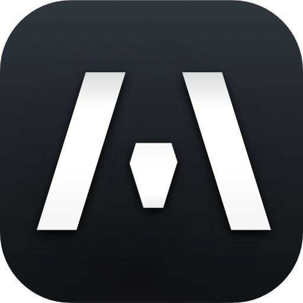
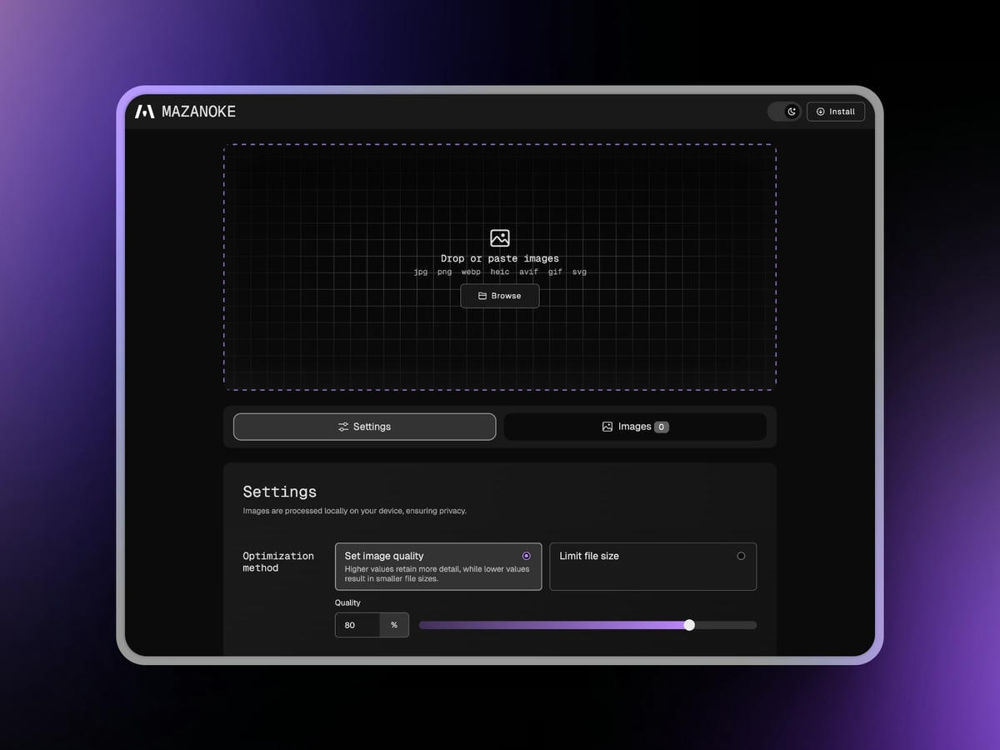
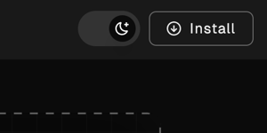
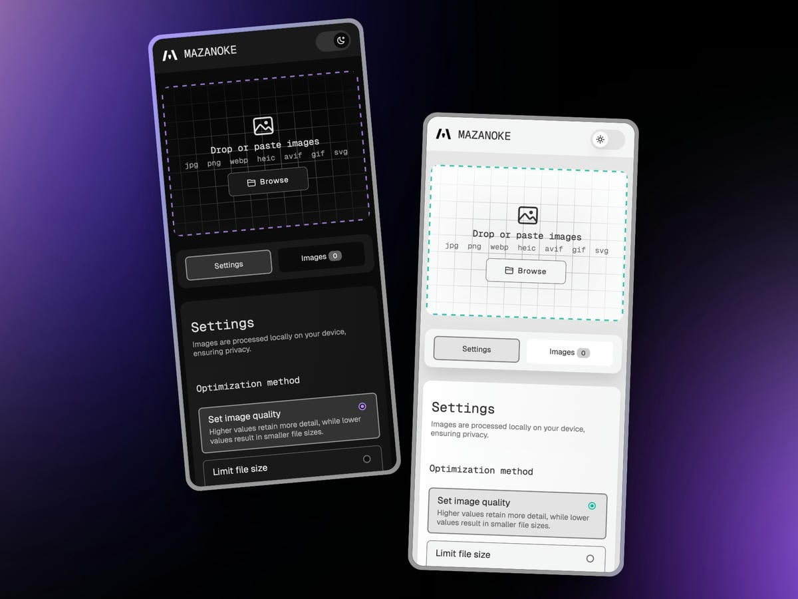
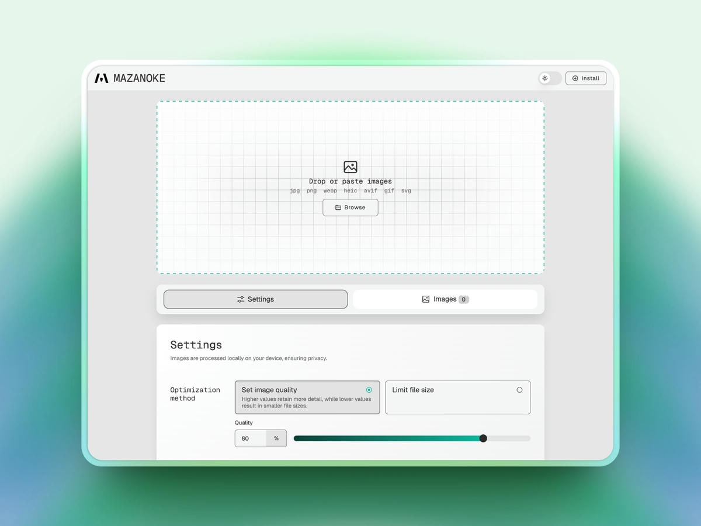
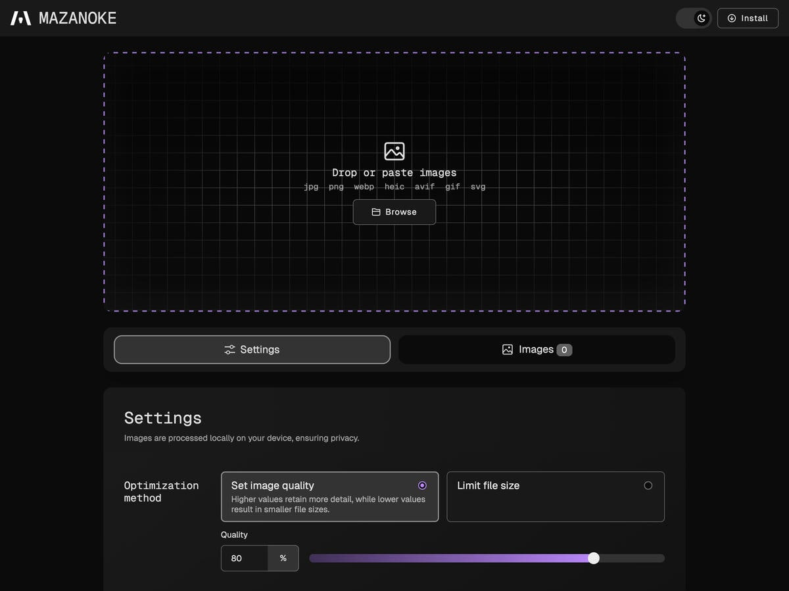
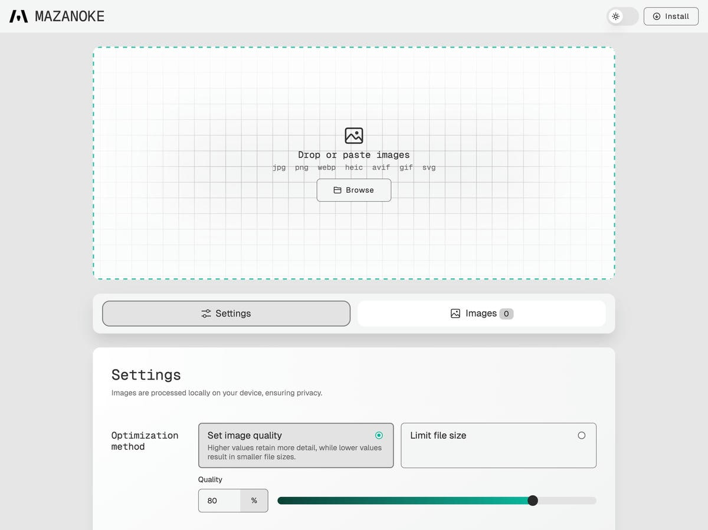
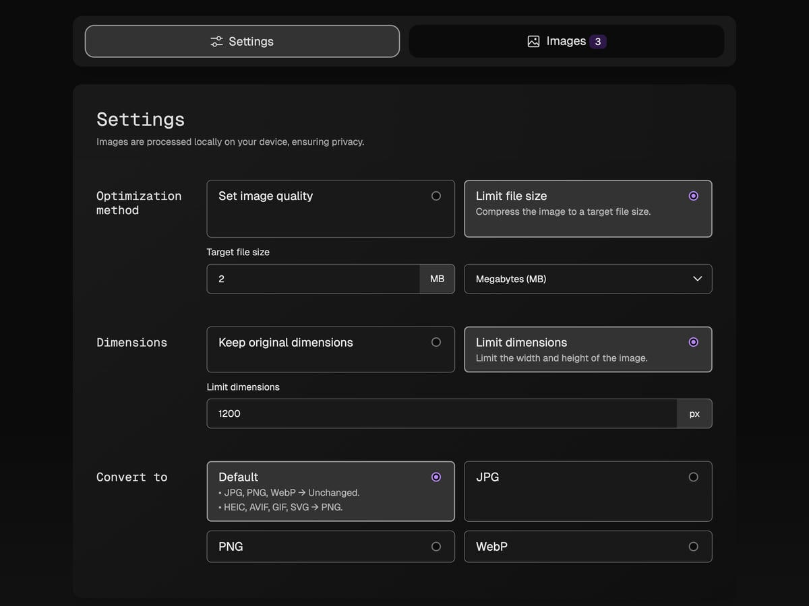
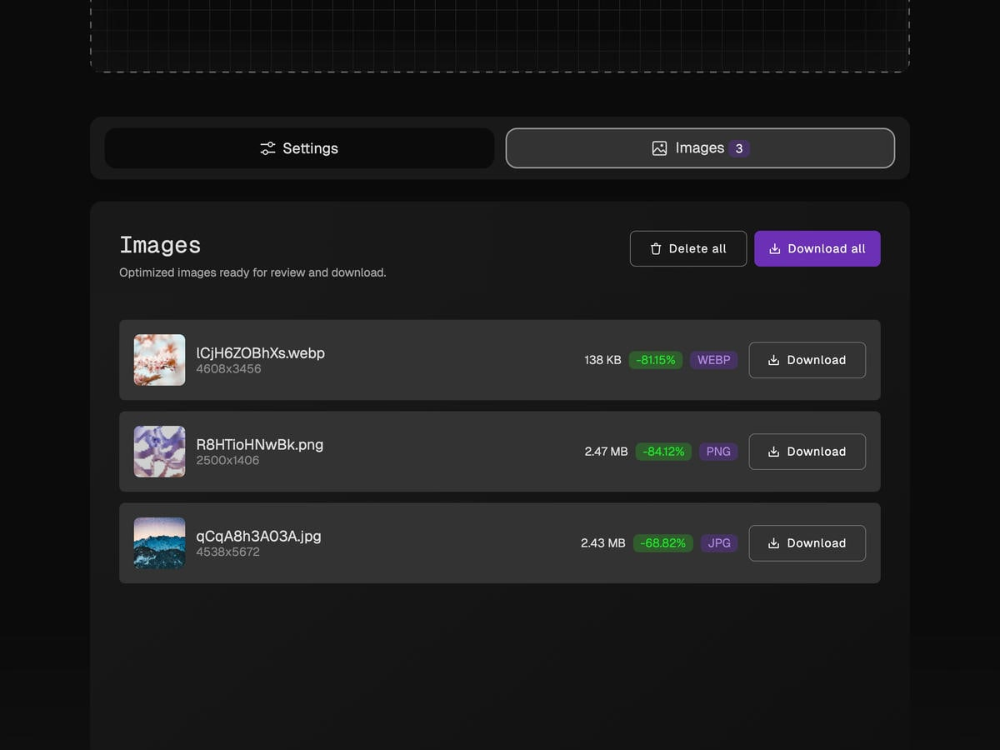

<h1 align="center">
  

   MAZANOKE
</h1>

<h2 align="center">一款在浏览器中本地运行的图片优化工具</h2>


<center>
   
</center>

## 关于
MAZANOKE 是一款简单的图片优化工具，它在浏览器中运行，可离线使用，并且确保您的图片完全在本地处理，保护您的隐私。

该工具专为普通用户设计，可以与家人和朋友分享，是那些可疑的"免费"在线工具的理想替代品。

## 目录
- [功能特点](#功能特点)
- [安装方式](#安装方式)
- [截图展示](#截图展示)
- [致谢](#致谢)

## 功能特点

- 🖼️ **在浏览器中优化图片**
  - 调整图片质量
  - 设置目标文件大小
  - 设置最大宽度/高度
  - 从剪贴板粘贴图片
  - 在 `JPG`、`PNG`、`WebP` 格式之间转换
  - 支持转换 `HEIC`、`AVIF`、`GIF`、`SVG` 格式
- 🔒 **注重隐私**
  - 离线工作
  - 设备本地处理图片
  - 移除EXIF数据（位置、日期等）
  - 无跟踪
  - 可安装为网页应用（[了解更多](#网页应用)）

**计划中的功能**
- [X] 一次上传多个文件
- [X] 支持更多图片文件类型
  - 最近添加了从 `HEIC`、`AVIF`、`GIF`、`SVG` 转换为 `JPG/PNG/WebP` 的功能
- [X] 记住上次使用的设置
- [ ] 图片裁剪

## 安装方式

### Docker

1. 使用 [Docker Compose](https://docs.docker.com/compose/):
```
services:
  mazanoke:
    container_name: mazanoke
    image: ghcr.io/civilblur/mazanoke:latest
    ports:
      - "3474:80"
```
2. 通过 `http://localhost:3474` 访问应用

### 本地安装

1. 下载[最新源代码发布版本](https://github.com/civilblur/mazanoke/releases)。
1. 在浏览器中打开 `index.html` 文件启动应用。

### 网页应用

1. 访问 [MAZANOKE.com](https://mazanoke.com/)，或者自行托管以获得更强的隐私保护。
1. 点击右上角的"安装"按钮。
   - 如果没有看到按钮，您仍然可以通过几个简单的点击手动安装它。（[查看方法](./docs/install-web-app.md)）
1. MAZANOKE 的快捷方式将添加到您的设备上，甚至可以离线使用。



## 截图展示

<center>
   
</center>

<center>
   
</center>

|    |   |
| :---: | :---: |
| 深色模式<br> | 浅色模式<br>  |
| 设置<br>  | 下载图片<br>  |

## 致谢
- [Browser Image Compression](https://github.com/Donaldcwl/browser-image-compression)
- [heic-to](https://github.com/hoppergee/heic-to), [libheif](https://github.com/strukturag/libheif), [libde265](https://github.com/strukturag/libde265)
- [JSZip](https://github.com/Stuk/jszip)

[查看完整列表和详情](./docs/ATTRIBUTIONS.md)

## 许可证
[GNU General Public License v3.0](https://github.com/civilblur/mazanoke/blob/main/README.md)